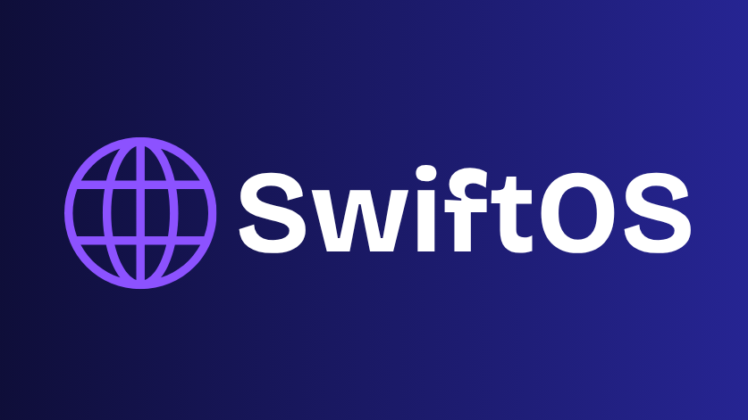

  

<h1 align="center">SwiftOS</h1>

## 🧭 Overview

**SwiftOS** is a comprehensive Windows 11 customization and optimization toolkit designed to give users full control over system settings, privacy, and appearance.  
It allows both standard users and administrators to apply targeted tweaks for improved performance, privacy, and personalization.

---

## ✅ Requirements

- **Operating System:** Windows 11 (21H2 or later recommended)  
- **PowerShell:** Version 5.1+ (PowerShell 7 supported)  
- **Execution Policy:** Must allow script execution (`RemoteSigned` or less restrictive)  
- **System Protection:** System Restore **must be enabled**
- **User Context:**
  * The launcher script must NOT be run with elevated privileges (Do not run as Administrator).
  * The launcher must be run as the currently logged-in user (no “Run As Different User”).
  * When running over Remote Desktop (RDP), user-level tweaks will be skipped because user context can be ambiguous. Only admin-level tweaks will run elevated.
- **User Privileges:**  
  * ✅ **User-level tweaks** → Run as a **standard user**  
  * 🔐 **Admin-level tweaks** → UAC prompt will request **administrator access**

> ⚠️ Make sure these requirements are met for smooth and safe operation.

---

## ✨ Features

### 🧑‍💻 User-Level Tweaks
- Show/hide file extensions and hidden files  
- Disable Bing in Start Menu Search  
- Disable taskbar transparency  
- Apply low-end performance visual tweaks  
- Set branded desktop and lock screen wallpapers  

### 🛠️ Admin-Level Tweaks
- Configure Windows Update policies  
- Remove bloatware and provisioned apps  
- Create a system restore point  
- Disable telemetry and Cortana  
- Apply high-performance power plans  

### 🧠 Additional Highlights
- **Safe Elevation Management**  
  Ensures proper context by separating user and admin tweaks  
- **Logging & Error Handling**  
  PowerShell transcripts record all actions  
- **Wallpaper Configuration**  
  Wallpapers stored in `Config/` are auto-applied by user script  

---

## 🚀 Usage

### 1. Clone the repository to your Windows 11 machine:

`git clone https://github.com/MMG-EG/SwiftOS.git`

### 2. Open PowerShell as a standard user
**⚠️ Do NOT run as Administrator**

### 3. Navigate to the script folder and run the launcher:

`cd path\to\SwiftOS`

`.\SwiftOS_Setup.ps1`

Follow the prompts in the terminal to apply customizations.

## 📄 License
MIT License © 2025 Mazen Gohar

## 📬 Support / Contact
For help, suggestions, or bug reports:

**📨 Email: mizoiology (at) gmail.com**

**🐛 Open an Issue on GitHub**

---

Made with ❤️ for Windows 11 enthusiasts
